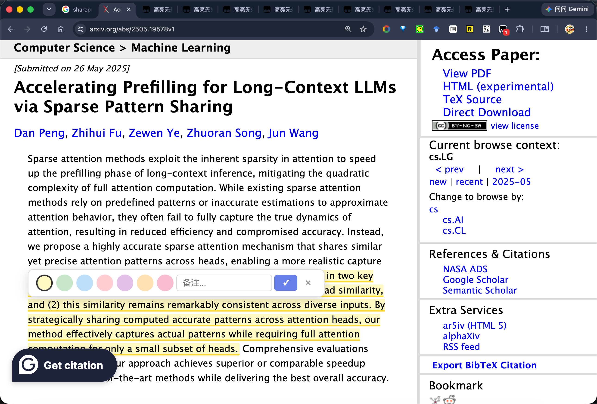
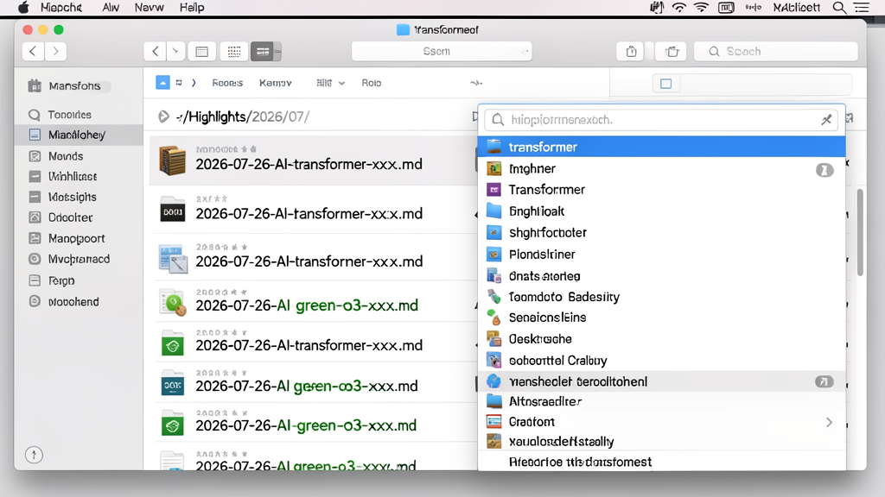

# 📌 Highlights Everywhere | 高亮无处不在

> **Highlight text, take notes, find them instantly via Spotlight.**
> **选中即高亮，随手记笔记，Spotlight 一键搜到。**

<p align="center">
  
</p>

<p align="center">
  <em>选中文字 → 工具栏自动弹出 → 选颜色 → 写备注 → 高亮保存</em>
</p>

<p align="center">
  
</p>

<p align="center">
  <em>Cmd+Space 直接搜到所有高亮内容</em>
</p>

---

## 中文介绍

### 这是什么？

一个让你在 **任何地方记笔记、做高亮** 的工具。选中文字 → 选颜色 → 写备注 → 存下来，然后 **macOS Spotlight（Cmd+Space）直接搜到**。

### 核心功能

| 功能 | 说明 |
|------|------|
| 🎨 **7 种颜色高亮** | 🟡黄 🟢绿 🔵蓝 🔴红 🟣紫 🟠橙 🩷粉 |
| 💬 **备注批注** | 每条高亮都可以写备注 |
| ✏️ **可编辑** | 点已高亮文字 → 改颜色 / 改备注 / 删除 |
| 🔍 **Spotlight 搜索** | 所有高亮存为文件，Cmd+Space 直接搜 |
| 🌐 **Web 展示** | 打开 `localhost:8899`，浏览器看全部高亮 |
| 🖥️ **CLI 工具** | `hl` 命令行保存、搜索、统计 |
| 🚀 **开机自启** | 服务器后台自动运行，无需手动启动 |

### 快速开始

> 💡 **数据存在 iCloud Drive**（`~/Highlights` → iCloud），Mac 和 iPhone/iPad 自动同步，手机"文件"App 也能搜到所有高亮。

```bash
# 1. 克隆仓库
git clone https://github.com/YOUR_USERNAME/highlights-everywhere.git
cd highlights-everywhere

# 2. 一键安装
chmod +x install.sh
./install.sh

# 3. 打开任意网页，选中文字试试
```

或者手动安装：

```bash
# 复制 CLI 工具
cp hl ~/scripts/

# 启动服务器（后台永久运行）
cp com.highlights.server.plist ~/Library/LaunchAgents/
launchctl load ~/Library/LaunchAgents/com.highlights.server.plist

# 安装 Tampermonkey 脚本（浏览器自动高亮）
# 打开 http://localhost:8899/highlight.user.js
# Tampermonkey 会自动提示安装
```

### 使用流程

```
1. 打开任意网页
2. 选中一段文字 → 🟡🟢🔵🔴🟣🟠🩷 工具栏出现
3. 点一个颜色 → 文字立刻高亮
4. 写备注 → ✓ 保存
5. 点已高亮的文字 → 可编辑 / 改颜色 / 删除
6. 刷新页面 → 高亮自动恢复
7. Cmd+Space 搜内容 / localhost:8899 网页看全部
```

### CLI 命令

```bash
hl "要保存的文字"              # 保存高亮
hl -c green -m "备注" "文字"   # 绿色 + 备注
hl -t "标签1,标签2" "文字"     # 带标签
hl search 关键词               # 搜索
hl list                       # 最近 10 条
hl stats                      # 统计
hl open                       # 打开文件夹
hlweb                         # 启动服务器 + 打开网页
```

### 技术原理

```
用户选中文字 → Tampermonkey 脚本 / 书签工具
  → fetch 发送到本地服务器（localhost:8899）
  → 服务器保存到 ~/Highlights/YYYY/MM/*.md
  → macOS Spotlight 自动索引
  → Cmd+Space 即可搜索
```

- **存储格式**: Markdown + YAML 元数据（人类可读）
- **搜索**: 底层使用 macOS `mdfind`（Spotlight）
- **数据安全**: 全在本地，不上传任何云端
- **文件位置**: `~/Highlights/`

---

## English Introduction

### What is this?

A universal highlighting & note-taking tool for macOS. **Select text in any app → pick a color → add a note → find it later via Spotlight.**

### Features

| Feature | Description |
|---------|-------------|
| 🎨 **7 Colors** | Yellow, Green, Blue, Red, Purple, Orange, Pink |
| 💬 **Notes & Annotations** | Attach comments to every highlight |
| ✏️ **Editable** | Click any highlight → change color / edit note / delete |
| 🔍 **Spotlight Search** | All highlights saved as files, instantly searchable via Cmd+Space |
| 🌐 **Web UI** | Open `http://localhost:8899` to browse all highlights |
| 🖥️ **CLI Tool** | `hl` command for save, search, stats |
| 🚀 **Auto-start** | Runs as a background service, no manual startup needed |

### Quick Start

> 💡 **Data lives in iCloud Drive** (`~/Highlights` → iCloud). Auto-syncs to your iPhone/iPad — searchable in the Files app on mobile.

```bash
# 1. Clone
git clone https://github.com/YOUR_USERNAME/highlights-everywhere.git
cd highlights-everywhere

# 2. One-click install
chmod +x install.sh
./install.sh

# 3. Open any webpage and select text
```

Or manually:

```bash
# Copy CLI
cp hl ~/scripts/

# Install background service
cp com.highlights.server.plist ~/Library/LaunchAgents/
launchctl load ~/Library/LaunchAgents/com.highlights.server.plist

# Install browser script via Tampermonkey
# Open http://localhost:8899/highlight.user.js
```

### Workflow

```
1. Open any webpage
2. Select text → 🟡🟢🔵🔴🟣🟠🩷 toolbar appears
3. Click a color → text is highlighted immediately
4. Add a note → ✓ save
5. Click any highlight → edit / change color / delete
6. Refresh page → highlights restore automatically
7. Cmd+Space to search / localhost:8899 for web UI
```

### CLI Usage

```bash
hl "text to save"                  # Save a highlight
hl -c green -m "note" "text"       # Green + note
hl -t "tag1,tag2" "text"           # With tags
hl search keyword                  # Search
hl list                            # Recent 10
hl stats                           # Statistics
hl open                            # Open highlights folder
hlweb                              # Start server + open web UI
```

### How It Works

```
User selects text → Tampermonkey script / bookmarklet
  → fetch to local server (localhost:8899)
  → saved as ~/Highlights/YYYY/MM/*.md
  → indexed by macOS Spotlight
  → searchable via Cmd+Space
```

- **Storage**: Markdown + YAML frontmatter (human-readable)
- **Search**: Powered by macOS `mdfind` (Spotlight)
- **Privacy**: 100% local, no data sent to cloud
- **Data Location**: `~/Highlights/`

---

## Project Structure

```
highlights-everywhere/
├── README.md                  # This file (中英文)
├── install.sh                 # One-click installer
├── hl                         # CLI tool (Python)
├── hl-server.py               # Local API + Web UI server
├── highlight.user.js          # Tampermonkey / bookmarklet script
├── com.highlights.server.plist  # macOS launchd auto-start config
└── hl-ext/                    # Chrome extension (reference)
    ├── manifest.json
    ├── content.js
    ├── background.js
    └── popup.html
```

## Requirements

- macOS (tested on macOS 26.1+, should work on 12.0+)
- Python 3 (built-in on macOS)
- Google Chrome / Safari with Tampermonkey (optional, for browser highlighting)

## License

MIT
